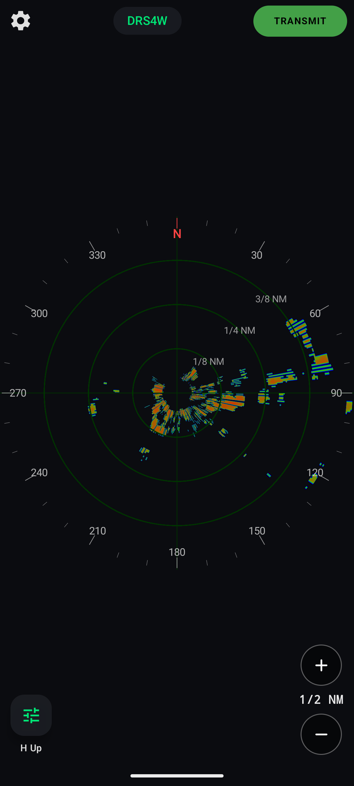
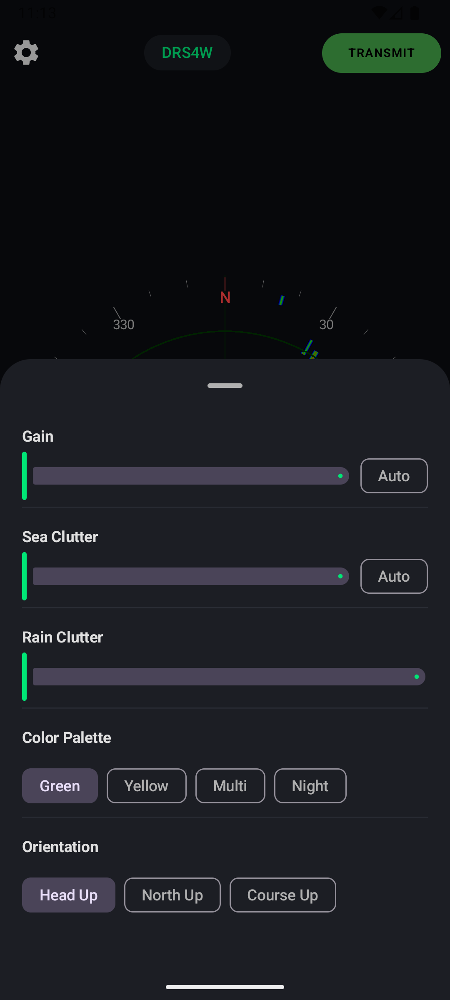

# Universal Marine Radar Display for Android

Universal Marine Radar Display for Android is a native Android application that displays marine radar data from supported radar hardware. It connects to a **mayara-server** backend (running
either as an embedded library or on a remote host) and renders live radar spoke data through OpenGL ES.

## Screenshots

| Radar Display | Display Settings |
|-------------|-----------------|
|  |  |

The app displays real-time radar data from supported radar hardware with full range control, gain/sea/rain settings, and multi-radar support.

## Supported Radar Brands

Fully supported and tested with real hardware:

- **Navico** — BR24, 3G, 4G, HALO 20, HALO 20+, HALO 24, HALO 2000–6000
- **Raymarine** — Quantum, RD series
- **Furuno** — DRS-NXT series (DRS4D-NXT, DRS6A-NXT, DRS12A-NXT, DRS25A-NXT) including dual range
- **Furuno** — DRS4W WiFi ("1st Watch")
- **Furuno** — FAR-2xx7 series

Implemented but awaiting real-hardware validation:

- **Garmin** — HD, xHD, xHD2, xHD3, Fantom, Fantom Pro (all models including dual range and MotionScope/Doppler)
- **Furuno** — DRS, DRS4DL, DRS6A X-Class, FAR-15x3, FAR-3000
- **Raymarine** — HD, Magnum, Cyclone

## Features

- **Real-time radar rendering** — OpenGL ES polar sweep display at full
  spoke rate (typically 2 048 spokes / revolution).
- **Dual connection mode** — Run the server embedded on the phone (via JNI)
  or connect to a remote server on the local network.
- **Range control** — Step through nautical, metric, or statute ranges
  using the +/− buttons. The available range list comes from the radar itself.
- **Gain / Sea / Rain / Interference** — All controls exposed through a
  swipe-up bottom sheet with sliders and auto toggles.
- **Color palettes** — Green, Yellow, Red / Green / Blue, and more.
- **Compass rose & range rings** — Overlay showing heading and distance.
- **Portrait & landscape** — Layout automatically adapts to device orientation.
- **Multi-radar** — When the server exposes more than one radar, tap the
  radar name pill to switch.

## Building & Architecture

See [DEVELOPER.md](DEVELOPER.md) for build instructions, architecture diagrams,
API endpoints, and CI workflow documentation.

## Attribution

This application is built on top of the excellent
[**mayara-server**](https://github.com/MarineYachtRadar/mayara-server) project — a comprehensive open-source
marine radar server that handles the low-level spoke decoding, radar
communication protocols (Navico, Garmin, Raymarine, Furuno), and SignalK API
layer. Without mayara-server, this Android app would not exist.

Huge thanks all contributors to the mayara project for making
high-quality radar software freely available to the marine community.

## License

This application is licensed under the **GNU General Public License v2.0**
(GPL-2.0). See [LICENSE](LICENSE) for details.

The embedded **mayara-server** library is also GPL-2.0 licensed —
see the [mayara project](https://github.com/MarineYachtRadar/mayara-servera) for details.
